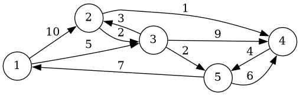

# Assignment 7

`Graph.hpp` and `Graph.cpp` have a quick implementation of a graph class. (Note that it's not practical for much besides the Bellman-Ford algorithm, but it's all we need at the moment.)

## Part 1

Implement `Graph::ShortestPath` in `Graph.cpp`.

## Part 2: 24.1-3

Consider the single-source shortest paths in `G` with source `s`. If the greatest
number of _edges_ in one of these paths is `m`, alter `Graph::BellmanFord` to terminate
in `m+1` iterations. (Note that this implementation of `BellmanFord` returns the
number of iterations performed if there is no negative-weight cycle and `INT_MAX` if
there is a negative-weight cycle.)

**Hint**: How can you use the unusual implementation of `Relax`?

The graph in the tests is:

